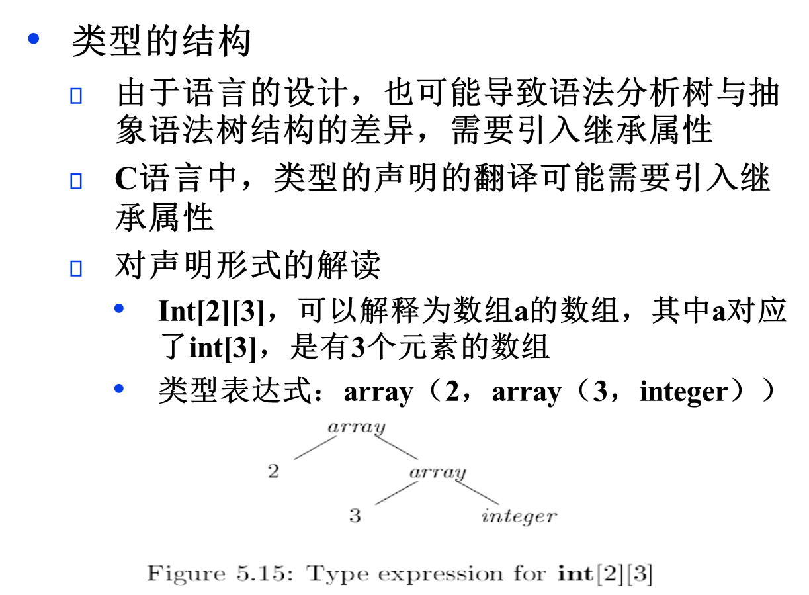

[TOC]
# 概述

产生式有翻译方案：成语义规则
和语法制导定义：产生式中加入语义动作

**完成语法制导翻译**
1.构造一个AST 访问个节点确定属性值 
- L属性：扫描过程中完成计算属性值
  
## 语法制导定义SDD
- 组成：属性和文法符号 规则和产生式

### 继承属性
- 自己和子节点决定
- 自己 父节点 兄弟节点
- 终结符 具有综合属性 是词法分析提供的词法值，无对应予以规则

### 定义
- 定义：
    每个文法产生式A→α的语义规则形式如下：

    其中：f是函数，b和c1 , c2 , … , ck 是该产生式的文法符号的属性，并且：
- 依赖关系：
上述两种情况，称属性b依赖于属性c1 , c2 , … , ck。

- 每个文法符号的继承属性集和综合属性集的交集应为空


#### 属性文法
- 左递归

- 无左递归有继承


### 从文法写出语义规则
1. n  val等于
2. 数位通过inh从左边传递到运算符所在的右边 
   val=syn 算出来后从下往上
3. 运算行：T1.inh=T.inh*F.val作为乘法 syn=传播
3. 空 syn=inh
4. digit val= digit.lexmal
### 注释分析树：
- 定义：每个结点都标记出属性值的分析树
分析树的注释（修饰）指计算各个结点属性值的过程
- 有些S属性的会无法存在循环求值

#### 为简单表达式构造语法树
节点op
- 叶子节点：函数Leaf ( op , val ) id的话就是符号表entry
- 内部节点：Node ( op , c1, c2 , … , ck )
##### 表达式文法构造语法树的S属性定义**
所有非终结符都有一个综合属性node
产生式3、4不构建新的结点


- 求值顺序：后续遍历或者自底向上
##### L属性
- 由于语法分析方法的约束，导致语法分析树的结构与抽象语法树的结构差异
- 引入继承属性，表明：由于子表达式x*y的x和*y出现在不同的子树中，x结点作为继承属性传递

val变成node


### SDD求职顺序
- 图中每个属性有一个结点
- 如果属性b依赖于属性c，则从c的结点到b的结点有一条边
- 注意！先进行所有词法分析器返回的计算
- 
#### S

- 按照任何自底向上的顺序计算
- 后序遍历，在最后一次离开某个结点N时计算N的各个属性值
postorder ( N ) 
{
    for  从左边开始，对N的每个子结点C）postorder( C );
    对N关联的各个属性求值
}
- 与LR分析过程结合，属性值存放在分析栈（后期语法分析栈）中，不用现实创建语法分析树的结点
#### L
- 自顶向下 深度优先 从左向右遍历
-
#### 受控副作用
 
#### 判断规则属性
1. 有继承属性肯定不是S 
2. 是S一定是L
3. 是否存在和规则一致求职过程：sl一定有 其他则画出依赖找出循环
#### 副作用
在某些时刻，翻译过程的副作用是需要的
打印计算器的结果
在语法树/符号表中标记相关对象的类型
- 控制SDD副作用：
  
#### 依赖图构造
- 语法分析树虚线 依赖图实线
分析树的依赖图的构造算法如下：
for 分析树的每个结点n do
    for 结点n的文法符号的每个属性a do
     在依赖图中为a构造一个结点
for 分析树的每个结点n do
    for 结点n的产生式的每条语义规则b := f(c1, c2, … ck) do
     for i := 1 to k do
        从ci的结点到b的结点构造一条边

**要点**
考虑产生式A→XY的语义规则：
    A.a := f(X.x , Y.y)，A.a是依赖于属性X.x和Y.y的综合属性，因此从X.x到A.a和从Y.y到A.a都有边
    X.i := g(A.a , Y.y)，X.i是依赖于属性A.a和Y.y的继承属性，因此从A.a到X.i和从Y.y到X.i都有边

### L

# 语法制导翻译应用
## 例子：类型结构
- 类型声明需要 继承属性（语法分析树与抽象语法树结构可能的差异
- 对声明形式的解读
Int[2][3]，可以解释为数组a的数组，其中a对应了int[3]，是有3个元素的数组
类型表达式：array（2，array（3，integer））

## 类型翻译的SDD
### 数组类型

# SDT语法制导翻译方案
- 在上下文无关文法中，将语义动作（程序片段）嵌入到产生式右部
- 何时执行？在该产生式的右部中，其左边的所有文法符号都已经被匹配之后立刻执行
**任何SDT都可以通过对语法树的前序遍历顺序实现**
## 后缀翻译方案(S属性SDD转为SDT)
- 语义动作都放在产生式的末端，在归约时执行该动作
- 自底向上分析，且SDD是S属性

### 语法分析栈
- LR完成
- 用文法符号代替状态（state），增加一个内容字段，记录文法符号对应的属性值

## 产生式内部带有语义动作的SDT
1. 语义动作可以放在产生式右部的任何位置
但要满足依赖关系
2. 对于产生式`B→X{a}Y`
- 自底向上的，则在X的此次出现在分析栈的栈顶（通过移进，或通过归约）时，立即执行语义动作a
- 自顶向下的，则在试图展开Y的本次出现（Y为非终结符）或在输入中检测Y（Y是终结符）之前，执行语义动作a

### 删除翻译方案中嵌入的动作(内部程序片段)
翻译方案中所有嵌入动作都变成只出现在最右端
1.方法：
在文法中加入产生ε的标记非终结符
每个嵌入动作用不同的标记非终结符M代替
把这个被代替的嵌入动作放在产生式M→ε的右端
对分析树的影响：
用额外的结点表示动作
**不能在语法分析中实现的SDT例子**

### SDT一般实现方法
1. 忽略语义动作，对输入进行语法分析，并产生一颗语法分析树
2. 检查每个内部结点N， 假设其对应的产生式是A→α，将α中的各个动作当作N的附加子结点加入，使得N的子结点从左到右和α中的符号以及动作完全一致
3. 对这颗语法树进行前序遍历，并且当访问到一个以某个动作为标号的结点时，立刻执行这个动作 

### SDT消除左递归
#### 简单情形（打印）
语义动作类似于打印字符串等（如后缀表达式的翻译），只要关注动作执行的顺序即可
将动作看成是终结符号，实施第三章介绍的消除左递归的算法即可
#### S-SDD
```
A→A1Y  { A.a := g( A1.a , Y.y ) }
A→X      { A.a := f( X.x ) }
```
```
A→X  { R.i := f( X.x) }  R  { A.a := R.s }
    R→Y   { R1.i := g( R.i , Y.y ) }  R1  { R.s := R1.s }
    R→ε  { R.s := R.i }
```

##### 继承属性被引入的原因：
把文法从左递归改成右递归后会出现继承属性
属性信息是从左向右流的，而归约也是从左向右进行，比较自然
改成从右归约后，信息的流向与归约的方向不一致，可能导致继承属性的出现

## L属性SDD转为SDT（作业）
- 将语义动作附加在语法分析树上，前序遍历时执行
1.把计算某个非终结符A的继承属性的动作插入到产生式体中紧靠在A的本次出现之前的位置上。如果A的多个继承属性以无环的方式互相依赖，则这些属性的求值动作顺序要满足依赖约束

2. 将计算一个产生式头（左部）的综合属性的动作放置在这个产生式体（右部）的最右端

# 实现L属性的SDD
1. a的参