[TOC]
# 中间代码的形式
## DAG
- 简化语法树的表示
标识了公共子表达式
公共子表达式不止有一个父结点

### 语法制导定义SDD构造DAG
在每次new一个结点时，要查重
生成DAG方式即第五章构造SDD生成语法树（node替代val）
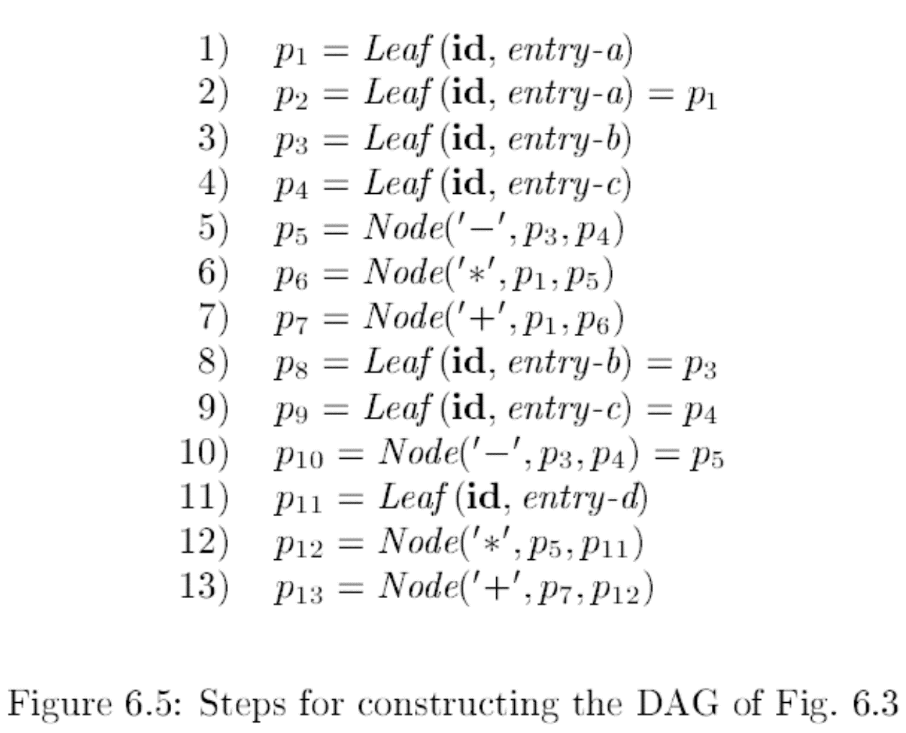

### 值编码
记录数组
数组的每一行表示一个记录（结点），用三元组表示<op，l，r>
记录的第一个字段是运算符代码，也是该结点的标号
叶子结点有一个附加字段，存放词法值
内部结点有两个附加字段，指向左右子结点
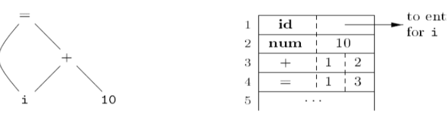

改进：散列


## 三地址代码
**一条指令的右侧最多有一个运算符**
### 地址和指令：三地址代码的两个基本概念
- 源程序名字作为地址：实际中，源程序的名字被替换为指向符号表的指针
- 编译器可生成的临时变量

- 指令：
x = y op z， op是一个双目算术符或逻辑运算符， x、y、z是地址
x = op y， op是一个单目运算符（如负号、逻辑非等，类型转换算符也是一个例子）， x、y是地址
x = y ，复制指令
goto L，无条件转移
if x goto L或if False x goto L，条件转移，if x relop y goto L
过程调用和返回同过下列指令实现：
param x call p，return y，
- x=y[i]和x[i]=y，前者把距离位置y处i个内存单元的位置中存放的值赋给x，后者将距离位置x处i个内存单元的位置的内容置为y的值
- x=&y、 x=*y和*x=y，地址和指针赋值指令
### 实现
#### 四元式
op：算符的内部编码
arg1和arg2分别表示y和z
result表示x
arg1、arg2和result的内容通常是符号表条目指针
注意：临时名字要进入符号表
op：1. 算符的内部编码
2. arg1和arg2分别表示y和z
3. result表示x
4. arg1、arg2和result的内容通常是符号表条目指针

#### 三元式
区别：临时变量用语句序号表示
- 例子：数组
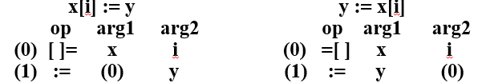
- 间接三元式 增加一个索引列表 重排statement实现

## SSA
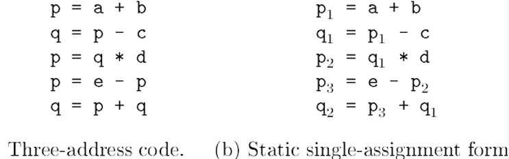

节点:是一种虚拟操作, 它能将多个对同一变量的定值合并成一个定值
换名技术: 把多次引用和多次定值分开
**改写技术？**

# 声明的翻译方法

## 类型
1. **类型检查**，利用一组逻辑规则推理一个程序在运行时刻的行为，即保证运算分量的类型和运算符的预期匹配
2. **翻译时的应用**，根据名字的类型，确定其存储空间；类型转换等
### 数据类型
是数据对象的一个重要属性
类型
位置
值
名
组件
#### 基础
数据类型规范的基本内容包括：
属性：区别这个类型的数据对象的属性
值：这个类型的数据对象可能取的值
操作：定义对这个类型的数据对象可能的操作集合
数据类型的实现
存储：表示程序执行过程中在计算机存储器中的数据类型的数据对象的存储表示
操作的实现：根据操纵数据对象的存储表示的特定算法或过程来表示数据类型所定义的操作的方式
数据类型的语法表示
属性：通过声明或类型定义来体现
值：表示成文字或已定义的常量
操作：可以通过特殊符号或内部过程（函数）实现，也可以隐式地通过其它语言元素的组合实现
### 类型表达式
类型表达式可以包含变量，变量的值是类型表达式
可以用图表示
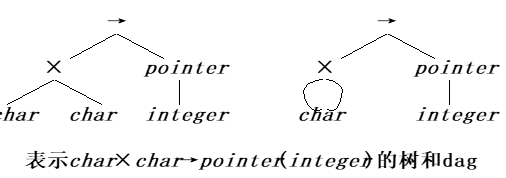

#### 类型构造器：
在一个已经说明类型的集合上创建新的类型
(数组、记录、指针等)
- 比如 struct关键字 typedef机制

组成：
##### 数组
如果T是类型表达式，则array（I，T）是成分类型为T和下标集合为I的数组的类型表达式
根据索引从小到大分配连续存储空间 行列主序
##### 积
##### 记录（一种结构）
它各域类型的积
记录的各个域是有名字的（与积的区别）
type row = record
            address:	integer;
            lexeme:	array[ 1 .. 15 ] of char
              end;
    var table: array [ 1 .. 101 ] of row;
声明类型名row代表类型表达式：
record( (address×integer)×( lexeme×array( 1 .. 15, char) ) ) 
##### 指针
如果T是类型表达式，则pointer（T）是表示类型“指向类型T的对象的指针”的类型表达式

##### 函数
1） mod函数，int ×int→int
2）在pascal中的声明：function f( a, b: char ): ↑integer
        char×char→pointer(integer)

#### 类型名管理
类型表类似于符号表 作用域类似变量作用域 
#### 类型等价
要处理的问题：两个类型表达式是否表示相同的类型
##### 结构等价（类型表达式完全相同）
- 定义：两个类型表达式是同样的基本类型
或两个类型表达式是同样的类型构造器作用于结构等价的类型
- 类型的合一替换中采用了结构等价
  
- **数据类型结构等价的例子**
1. 两个数组是等价的当且仅当它们有相同的大小和元素类型
2. 两个结构是等价的当且仅当它们有相同的元素，并且元素有相同的名字和顺序
结构中，元素的顺序是重要的
如果不考虑数组的界，则数组等价的测试可以重写为：
如果有：	s = array( s1 ,  s2 )
            t = array( t1 ,  t2 )
测试算法中的第4和第5行改写为：
    else if s = array( s1 , s2 ) and t = array( t1 , t2 )  then
        return sequiv( s2 , t2 )
##### 名字等价
与结构等价的不同
在结构等价中，类型名字由它们定义的类型表达式代替，当所有的名字替换后，两个类型表达式变成结构等价的类型表达式，则它们结构等价
- 碰到record架构器时，结构等价停止，只比较是否同样的命名记录
##### 数据


## 声明
将程序执行时所需的数据对象的名字和类型的信息传给语言翻译器的程序语句
1. 传递信息：告诉编译器数据对象的名称和类型。
2. 生命周期：指明数据对象在程序中存在的时间范围。
3. 存储信息：指定数据对象的存储方式，如在内存中的位置。
```c
D → T id ； D   |   ε
T → B C  |  record ‘{’ D  ‘}’
B → int  |   float
C → ε   |  [ num ] C
```

### 种类
1. 显式声明：程序员在代码中明确写出声明语句，如在C语言中int x;。
2. 隐式声明：编译器根据上下文自动推断数据对象的类型和名称，不需要程序员显式声明。

声明的目的：

存储表示：选择数据存储的方式，如栈、堆或寄存器。
存储管理：管理数据对象在内存中的分配和释放。
多态操作：允许同一个操作对不同类型的数据对象执行不同的行为。
类型检查：确保操作符和数据类型匹配，避免类型错误。
### 声明的序列
1. 初始化引入offset，跟踪下一个可用的地址
offset初值为0，表示每个过程的第一个变量的偏移为0
每次处理一个变量x
2. 将x入符号表，其相对地址置为offset的当前值
将x的宽度加到offset上
id出现：首先执行top。put（id.lexeme,T.type,offset）
3.**生成空的非终结符成为标记非终结符**可重写产生式，使得所有的语义动作出现在产生式右端尾部，
 P → M D
 M → ε  { offset = 0； }

#### 记录和类中的字段
表示记录的文法产生式
T → record ‘{’ D ‘}’
**一个记录中各个字段的名字必须互不相同
字段名的偏移量是相对于该记录的数据区字段而言的**
##### @嵌套 符号表env表示
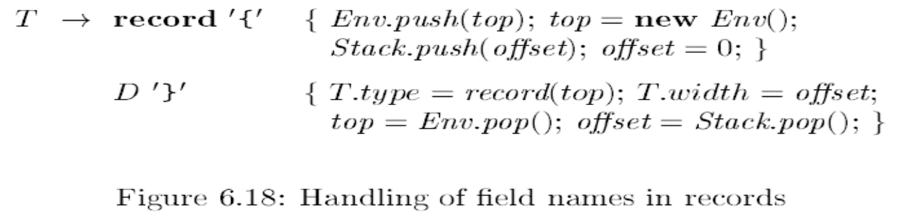
1. 在进入记录时，初始化一个新的记录描述
保存原来的符号表（Env.push(top))和offset
初始化一个新的符号表（new Env())和offset
2. 声明结束后
登记类型（T.type = record(top)），并将宽度置为offset
恢复被入栈的原符号表和offset

# 可执行部分的翻译
## 程序结构
### 局部变量名的存储布局
- 编译器对变量声明的处理
1. 记录其类型
2. 计算其偏移地址 **地址对齐aligned**
作为未来存储分配的依据
对于变长类型（如字符串）或动态数组等运行时才确定大小的数据对象，一般为指向这类对象的指针保存一个已知的固定大小存储区域
#### @数组类型的翻译方案
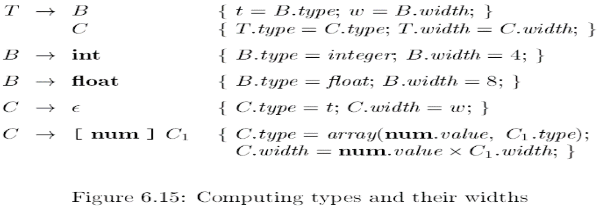

![int[2][3]](image-30.png)

## 类型检查
### 静态检查：由编译器完成
1. 信息来源：写代码时类型声明和其他语言结构，如变量声明、函数定义等。
2. **检查内容：**
操作的参数和结果的数目、顺序和数据类型是否匹配。
变量所命名的数据对象的类型是否一致，且在程序执行过程中保持不变。
常数数据对象的类型是否正确。
3. 在某些情况下，不能进行静态类型检查
如数组访问越界的检查
### 动态检查
- 在每个数据对象中保存一个表明该对象数据类型的类型标签
- 不需要在编写代码时就明确变量的类型
- 通常不需要显式地声明变量的类型
- 数据对象类型可变 与一个变量名绑定的数据对象的类型
### 类型系统
定义：把类型表达式指派到各个部分的一组规则
类型检查器实现类型系统
健全的类型系统（sound type system）确实侧重于在编译时（静态时期）进行类型检查，以确保类型安全。
#### 强类型
- 如果一个语言的编译器可以保证它所接受的程序不会有运行时的类型错误，则称这个语言是强类型的
- c不是 但近似认为

### 类型检查规则

#### 类型综合和推导
根据子表达式的类型构造出表达式的类型
要求名字要先声明再使用
典型的形式：
    if      f的类型为s→t且x的类型为s
    then 表达式f (x)的类型为t
- 根据一个语言结构的使用方式确定该结构的类型
推导过程中可能引入类型变量，一般用α、β等表示
典型的形式：
    if      f (x)是一个表达式
    then 对某些α和β， f的类型为α→β且x的类型为α
### 类型转换
#### 拓宽 和
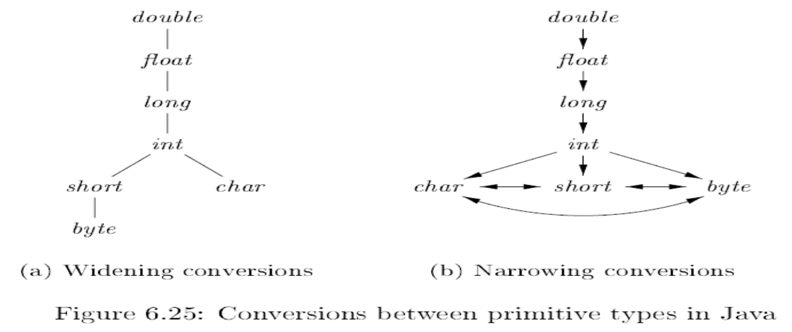
#### 翻译实现
max( t1 , t2 )函数，接受t1和t2两个类型的参数，并返回二者在类型转换图中的最小上界
widen( a , t , w )函数（如下页图6-26），生成代码，实现将地址a中的类型为t的内容转换为w类型的值的功能
如果t和w相同，则该函数返回a本身
**翻译方案**
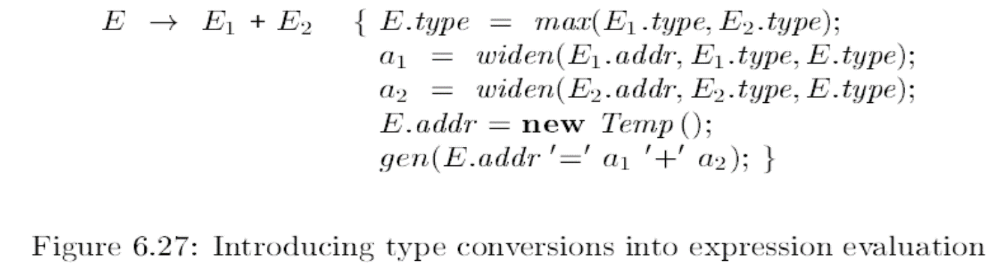
widen和max使用后写成三地址🐎形式
### 类型确定
当一个名字的类型有多种可能时：依据上下文类型信息的最终确定
#### @重载（简单）
针对重载函数的类型综合规则
If     f可能的类型为si→ti  ( 1≤i ≤ n )，其中，si ≠ sj ( i≠j )
and  x的类型为sk  ( 1≤k ≤ n )
then 表达式f ( x )的类型为tk

缩小可能类型的集合
在一些情况下，完整的表达式要求有唯一的类型
根据上下文，缩小每个表达式的类型选择，直至唯一
如果最终仍然不能得到唯一的类型，则报告类型错误
增加继承属性unique


##### 重载的消除

- 只看参数无法消除重载

#### 类型推导和多态函数（更一般）
多态函数允许一个参数有不同的类型
函数体中的语句可以在不同类型的参数下执行
算符也可以是多态的

- 类型推导和例子
  

在类型推导的语境下，类型等价的概念要重新审视

##### 置换
实例
用s < t表示s是t的实例
    pointer(integer) < pointer(α)
    pointer(real) < pointer(α)
    integer→integer < α→α
    pointer(α) < β
    α <β
(代换不能用于基本类型)
    integer →real	α→α 	(α的代换不一致)
    integer →α		α→α 	(α的所有出现都应代换)

##### 和一替换
##### 多态函数类型推导 
通过必须合一推导出各种函数中类型变量的type
**推导图**
- 用新的类型变量an替换受限变量


## 控制流
### 布尔表达式
||和&&都是左结合的
||的优先级最低，其次是&&，!的优先级最高
rel算法包括<、<=、=、!=、>和>=
- 用控制流：即用程序中的位置表示布尔表达式的值
如果有E1 || E2，当E1的值可以确定为真时，则可以确定整个表达式的值是真，不必计算E2
简化了布尔表达式的计算
#### 数值表达式
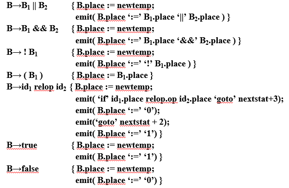
### 短路代码
- 定义：将布尔表达式翻译成没有任何布尔算符的三地址代码，运行时只计算部分表达式
- 例子：if ( x < 100 || x > 200 && x != y ) x = 0 ;
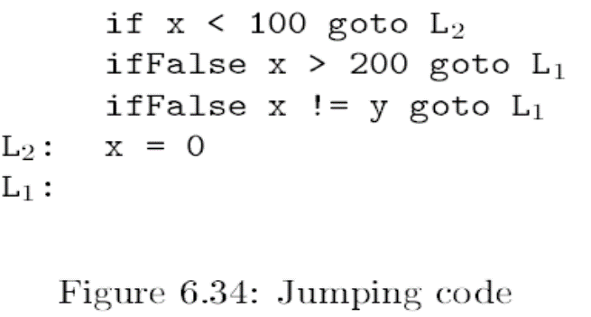
### 控制流语句
- 引入综合属性code，给出翻译得到的三地址代码
首先构造语法树，并在遍历树的过程中产生目标代码
- 符号标号的生成：函数newlabel每次调用时返回一个新的符号标号
- 符号标号的引入：对每个布尔表达式B引入两个标号
B.true：B为真时控制流向的标号
B.false：B为假时控制流向的标号
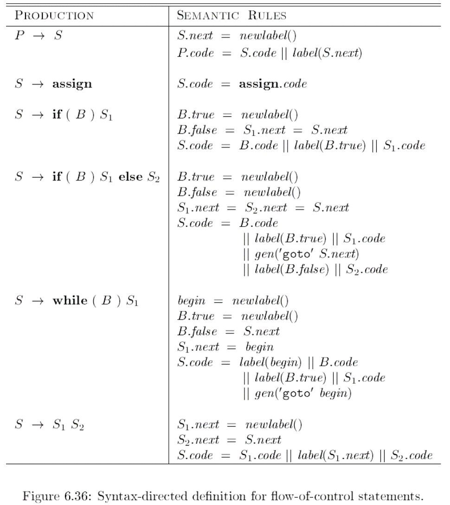
#### 布尔表达式的控制流翻译
1. B→E1 rel E2，
直接翻译成三地址比较指令，跳转到正确位置，如a<b翻译为：
if  a < b goto B.true
goto B.false
2. B→B1 || B2，考虑短路代码
如果B1为真，则整个表达式为真，因此B1.true=B.true
如果B1为假，则要计算B2，因此B1.false为B2的入口指令的标号
B2的真假出口分别等于B的真假出口
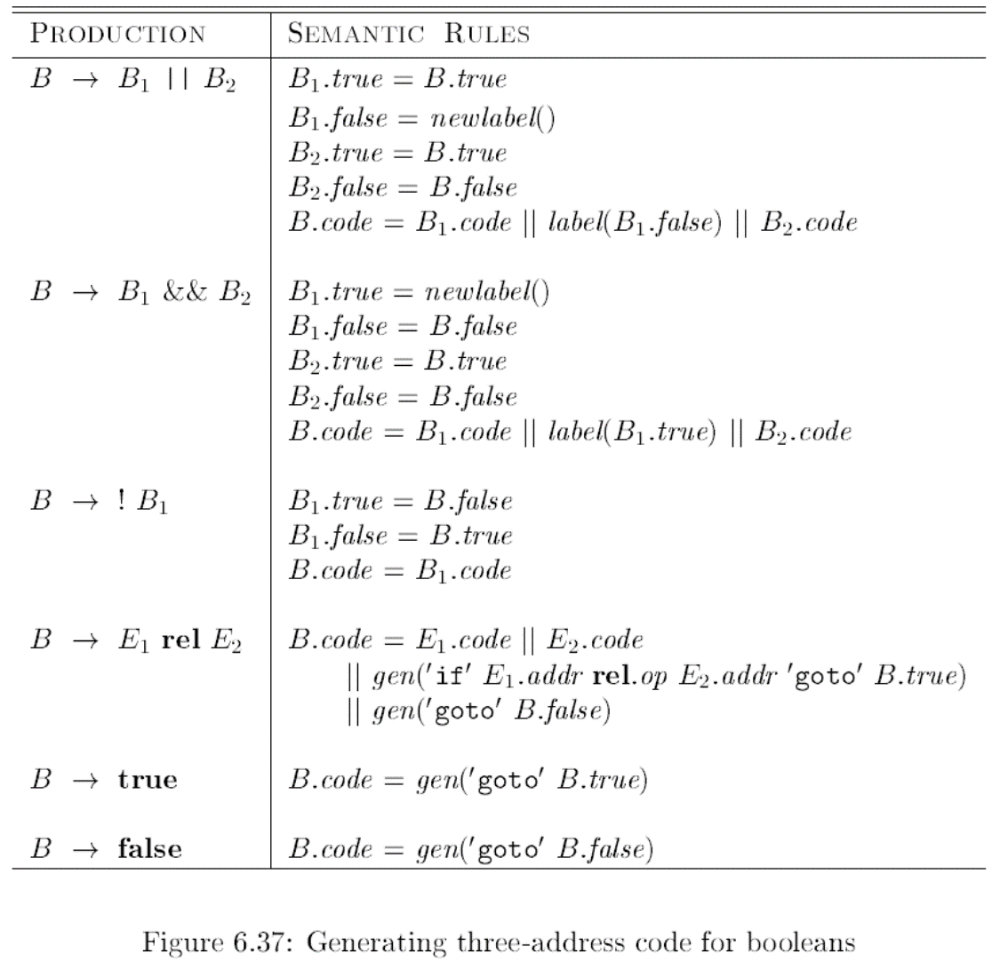
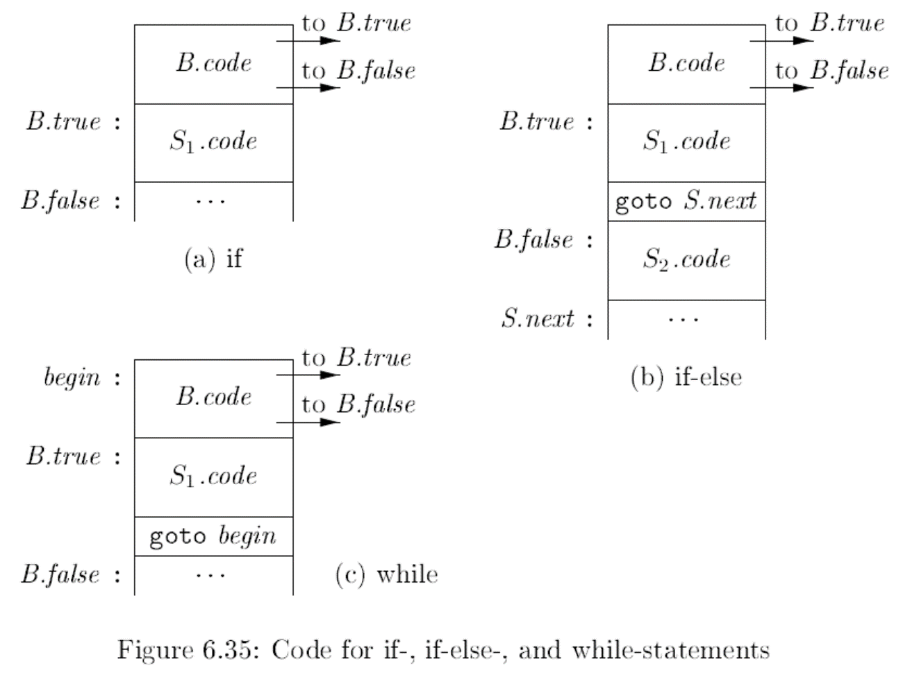
##### 避免生成让冗余goto指令
1. iffalse
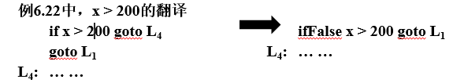
2. fall 将true改成fall fall免去label（连续语句中的跳转）
   ```
   B.true = fall
    B.false = S1.next = S.next
    S.code = B.code || S1.code
   ```
##### 尽可能允许控制流穿越
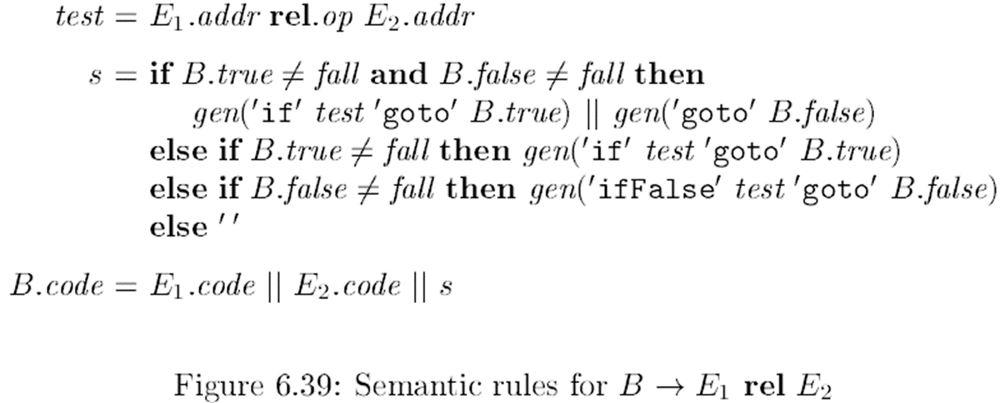
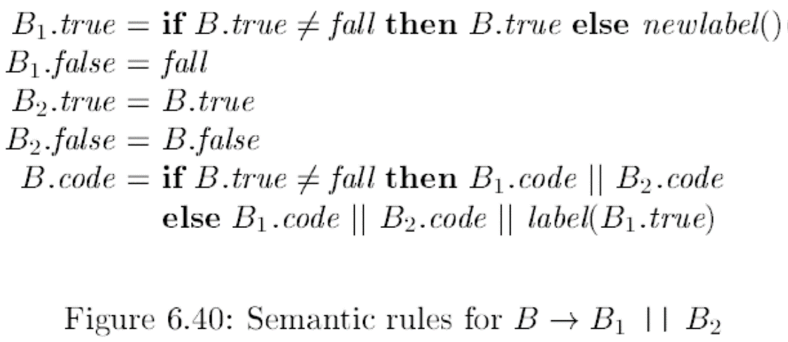
### 回填
- 对于非终结符B
B.truelist是B为真时控制流应该转向的标号列表
B.falselist是B为假时控制流应该转向的标号列表
- 语句S，
引入综合属性S.nextlist
- 三个函数 处理指令数组
1. makelist( i )，创建一个只包含i的列表， i是指令数组的下标，makelist返回一个指向新创建列表的指针
2. merge(  p1 , p2 )，将列表p1和p2合并，并返回指向合并后列表的指针
3. backpatch( p , i )，将i作为目标标号插入到p所指列表中各指令中
4. 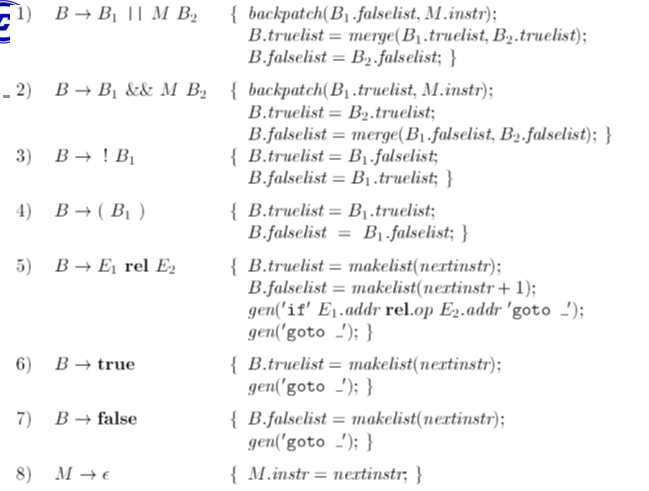
#### 控制转移语句
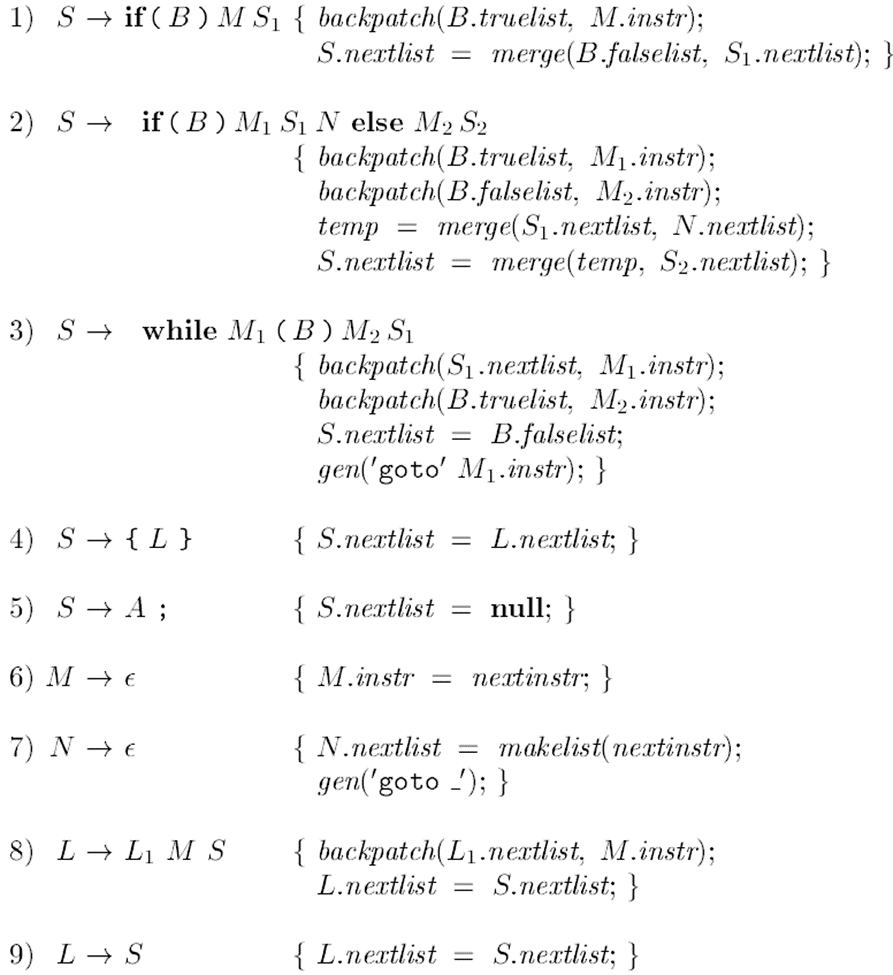
- 标记非终结符N
实现条件语句if (B ) S1 else S2的语句执行S1后，控制跳过S2的动作
 N有属性N.nextlist，表明期待if (B ) S1 else S2下一语句的出现
- break语句：将控制流跳出到外围的语言结构
执行外围语言结构的下一条语句
翻译方法
跟踪外围语句S
为break语句生成为完成的跳转指令
将这些指令放到S.nextlist中
- Congtinue语句：在循环中，触发外围循环的下一次迭代
处理方式类似于break，但是跳转目标是循环的开始位置

#### 自底向上翻译方案
```
 B→ B1 || M B2  |  B1 && M B2  |  ! B1  |  ( B1 )  |  E1 rel E2  | true | false
   M→ ε
```
- 引入标记非终结符M
在适当的时刻获取将要生成的下一条指令的下标（标号）


# 过程函数翻译
## 表达式翻译
### @为表达式生成三地址
我理解：用一个SDD生成三地址
#### code属性
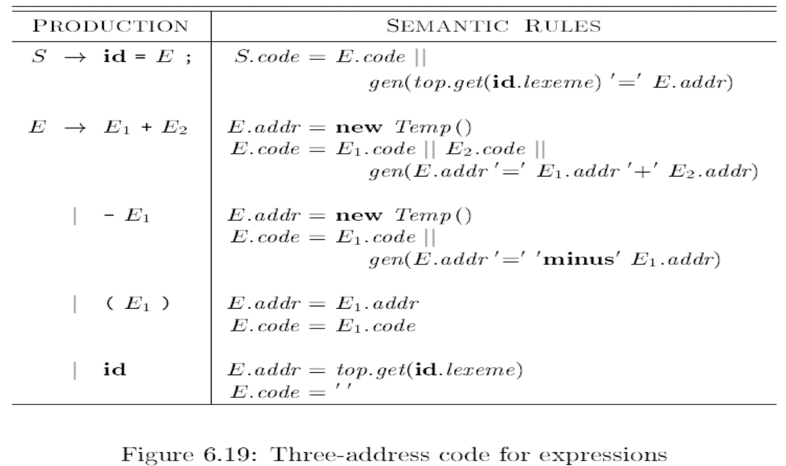
- **E→id**


E.addr就是符号表条目的指针，据此可以得到其名字，top.get（id.lexeme）
E.code为空串
- 括号E→（E1）
只需属性的复制（addr 和code）
- 需要生成三地址
临时变量 addr 
拼接代码 生成计算gen
- 赋值S → id = E
top.get(id.lexeme)表示从（栈顶）符号表取出id的地址，以完成赋值

#### 增量翻译
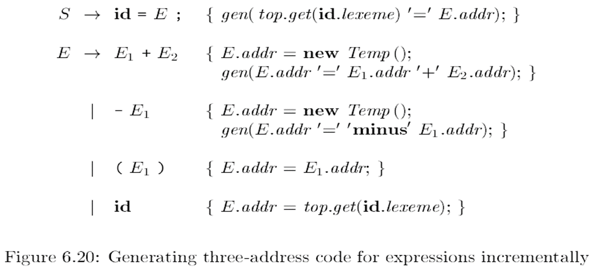
- 当addr表示结点地址时，可以生成语法树
**不加code的区别**

### 数组元素的寻址 
- 优化A[ i ]的相对地址是base + ( i – low ) * w
优化的计算方式：i * w + (base – low * w)，后一部分可以在编译时刻计算
- A[ i1，i2 ]的相对地址：
        base + (( i1 – low1 ) * n2*w+ ( i2 – low2 ) * w
优化得到： ( ( i1 * n2 ) + i2 ) * w + (base - ( ( low1 * n2 ) + low2 ) * w)
- 列主序：base + ( ( i1 – low1 ) + ( i2 – low2 ) * n1 ) * w
#### 翻译
- L → L [E ]   |  id [ E ]
L有三个综合属性
1. L.addr指示一个临时变量，用于累加ij*wj项，计算数组引用的偏移量
2. L.array是一个指向数组名字对应的符号表条目的指针
L.array.base存放了该数组的基地址
3. L.type给出L生成的子数组的类型，
对于任何类型t，t.width给出其宽度，如果t是数组类型，t.elem给出其数组元素的类型
**数组翻译**
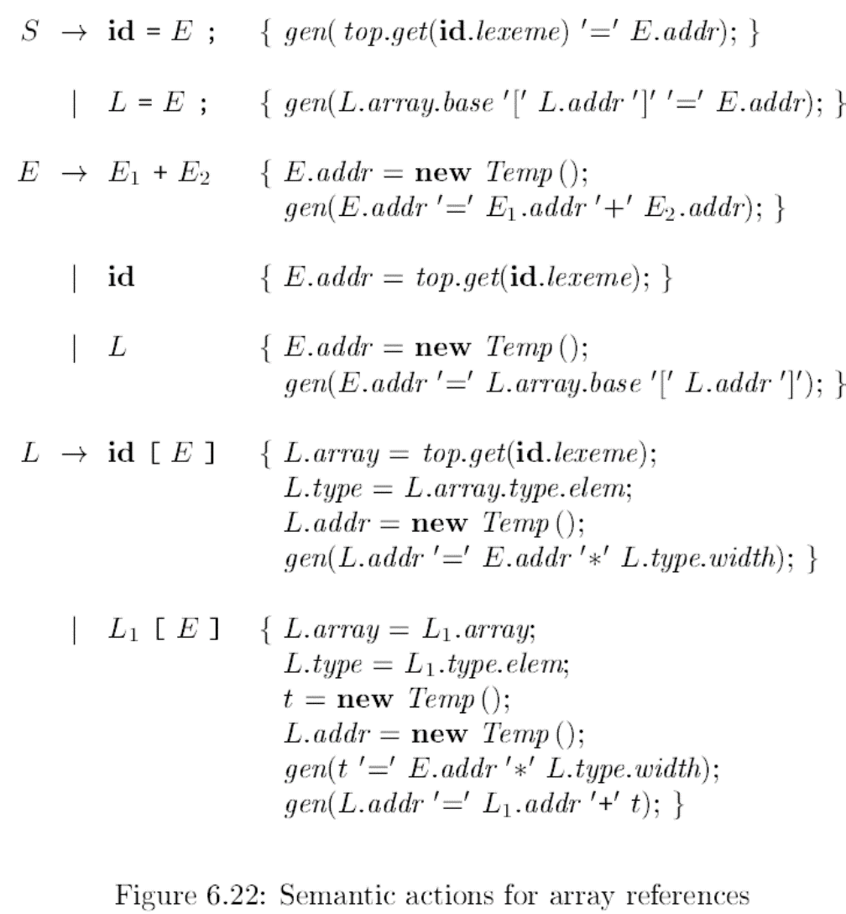

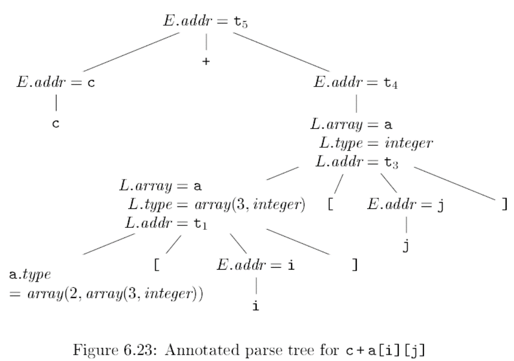
- 数组引用三地址代码类似于L.array.base[L.addr]，表示基地址与偏移量相加得到实际的地址


## 过程翻译
函数调用被拆分为准备进行调用时的参数求值，然后是调用本身
参数传递采用值调用方式
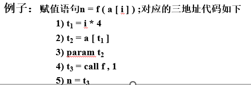
- 函数类型：包括返回值类型和形式参数类型 **类型等价性检查**
- 符号表：设编译器处理到一个函数定义时，最上层符号表是s
函数名放入s，以便在程序的其他部分使用
函数的形参可用类似于记录字段名的方式处理
在D的产生式中，在看到关键字define和函数名后，将s压栈，并建立新的符号表t
        Env.push(top); top = new Env(top)
top指向符号表栈栈顶的符号表，top = new Env(top)实现了嵌套  aa
- 类型检查：在表达式中，函数和运算符的处理方式相同
使用6.5.2节的方式进行进行类型检查，包括必要的自动类型转换
- 函数调用：对于函数调用id(E,E,…,E)
首先生成对各个实参（各个E）求值得三地址指令，或者生成将各个参数E归约为地址的三地址指令
然后为每个参数生成一条param指令
上述方式可能使得参数的求值与param指令混杂在一起，一种改进方式是：
将每个表达式的属性E.addr放在一个数据结构（如队列）中
在所有表达式翻译完成后，一次性生成所有param指令

