**作用域**
x的一个声明的作用域（scope）程序的一个区域，在其中对x的引用都指向这个声明。作用域可以是在词法上不连续的区域
名字x的一个顶层声明的作用域
从声明位置开始起作用
函数中的对同名变量的声明产生的局部作用域，将在函数体内覆盖该同名全局变量的全局作用域，因此作用域可能存在“洞”
C语言中“块”的语法要求如下：
块是一种语句
一个块包含了一个声明的序列
允许嵌套（这点与函数不一样），因此作用域规则也要考虑嵌套的问题

[toc]
## 语法制导翻译器
前端模型
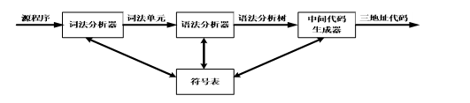
- 中间表示：AST 和 三地址代码
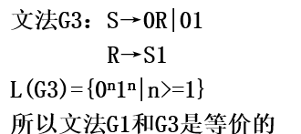
- 乔姆斯基理论：
1. 1型
   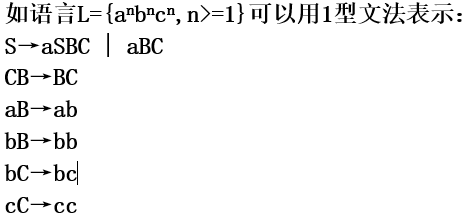
2. CFG
3. 正则
### 语法
#### AST和推导
- 句子：自左向右将语法树的所有叶结点依次连接，就可以得到符合文法的一个句子：不包含非终结符的句型
- 句型：如果将语法树中的一个子树完整去掉，则将剩余语法树的所有“叶”结点自左向右相连，就得到一个句型
##### 二义性
- 定义：多个语法树（如果一个文法，对于同一个终结符号串，存在两个或多个与之对应的语法树）
#### 语法分析树的归纳法
归纳量：推导步数（语法分析树节点）
#### 语法制导翻译
- 构建一个从中缀表示方式翻译为运算
符在运算分量之后的后缀表示方式
### 符号表
- 各阶段都能使用
- 每个作用域一个 
  #### 作用域
可以嵌套
### 文法
#### 从状态机写出CFG
大概思路：左递归的写，

## 词法分析器：
1. 手动：每个此词法单元的词法结构图或其他描述
    代码识别每个词素，并返回词法单元的信息
2. 自动：向工具描述词素模式LEX
3. 描述词素模式-正则表达
4. 转换正则表达-转为NFA-转为DFA
5. 词法分析的核心部分：驱动程序，和对自动集的规约
   
### 词法分析的作用和好处（ppt1 2）
- 第一阶段：读源程序，产生词法单元，用于语法分析
- 完成和用户接口的任务
- 词素

#### 词法分析器步骤（我总结）
1. 扫描阶段：不需要词法单元的简单文本处理 删除空格
2. 现标识符词素，词素进入符号表，生成洗发单元给语法分析

#### 词素划分和词法值
- 记号定义为枚举型：关键字、算符、标识符、常数、字符串、标点符号等
- 属性值 
  1. 标识符：词素、类型、第一次出现位置（报错）等属性值放在符号表中，因此为指向符号表中X条目的指针
  2. 标点符号、关键词：无属性值
  3. 数字、字符串：字符序列
  4. 运算符：如果细化唯一则不需要
 _例子 ppt8_
- 有些语言词法分析需要区分关键字和保留字

#### 词法错误

#### 输入缓冲
- 定义：词法分析程序可能要向前看若干个字符，才能决定词素符号的确切性质

- 开始指针（lexemeBegin）是词素首字符 和向前指针（forward）当前读头
- 识别完成后，返回语法分析（forward可能需要回退）
- 哨兵：检测是否到达末尾
  
### 文法
- 子串：删除某前缀或后缀
- 子序列：删除任意多个符号
- 符号串集合的乘积：AB=A中一个连接上B中一个
  
#### 正则式
- * 》 连接 》|  *是幂等的

##### 正则定义和文法
- 定义：左端di是新符号，各不相同，右端ri是正则表达式 
- 正则文法：正则文法的产生式左端是文法的一个非终结符，而右端是一个符合特定形式的文法符号串

缩写和扩展（ppt28）

### 词法单元的识别
一个程序 读源程序，将词素的语法单元给语法分析
- 特殊的词法单元ws：空格 换行 tab 会跳过
#### 转换转换图
一个词法单元一个转化图
##### 区分保留字和标识符
保留字在初始化时入符号表
##### 各类词法单元转换图
需要回退的情况：需要知道在哪结束
  1. 识别id 遇到第一个不是数字不是字母的才知道识别结束
   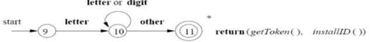
  2. 识别关键字
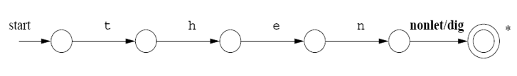
  1. 识别number
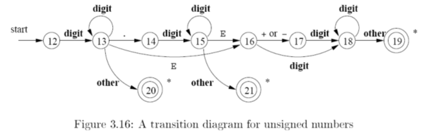
  1. 识别空白符
   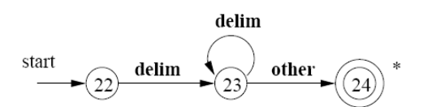
像运算符这种个数限制的就不用回退

##### 转换图实现（运行步骤）
1. 当前终态，返回符号表相关信息
2. 有边离开该状态，则读入一个字符，并根据这个字符选择后续的状态，并将控制转交那个状态
  1. 如果出边没有匹配的字符，且该状态不是终态，则调用失败子程序，把输入指针撤回到开始指针的地方，启动对下一个转换图的记号的搜索
  2. 如果不存在下一个转换图，则调用错误恢复子程序
##### 程序实现：case和switch
case分为3类：
1. 识别该词法单元的正常字符 并转换图
2. fail（）:全局错误恢复策略：forward指针回到词素开头，用另一个转换图；没有转换图能用，用错误纠正
3.回退

集成到分析器：
1.优先级的顺序（先保留后id）2.并行最长匹配 3.合并 优先最长

## 状态机
正则式、正则文法、有穷状态自动机的描述能力是一样的
正则文法（2型）必须有一个终结符 是CFL（1型）的子集

### NFA
#### 识别正则表达
(ppt 67)
##### 从正则式到NFA：构造算法Thompson算法
-每步最多引入 _两个新的状态_，NFA最终的状态数最多是正则式中 _符号和算符数的两倍_
- 基本规则：
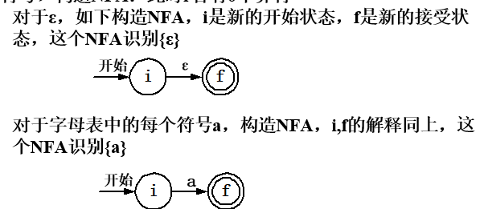
- 归纳规则：
1. 并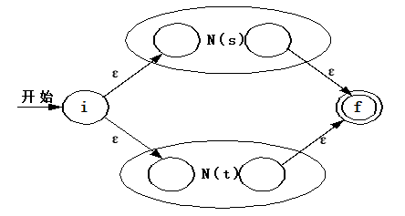
2. 连接 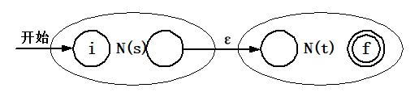
3. * 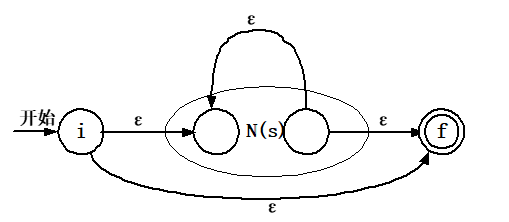
##### 转换表
二维数组 状态竖列，终结符横列
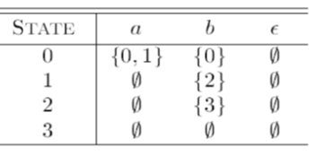

#### NFA和DFA转换
关于状态s的空闭包，和转换函数的move的空闭包
##### 状态集合T的ε闭包的计算
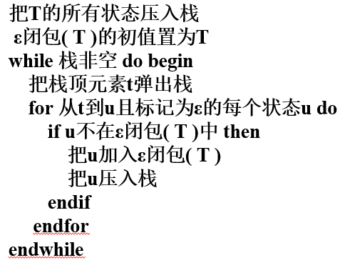 用栈来运算
##### 子集构造法
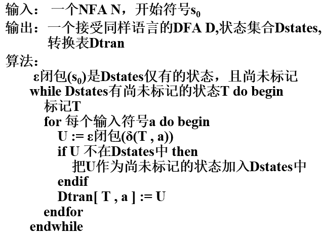
接受状态：至少包含一个NFA的接受状态
两者具有等价性
NFA状态 DFA状态 输入符号

##### DFA化简
- 不可区别：相同输入字符，进入的状态集一样
1. 死状态：保证每个符号都右转换
2. 划分 接受组和非接受组
3. 对一个状态组，不断检查输入是否可以划分
#### NFA模拟
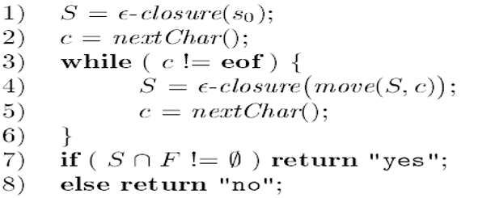
##### 效率
newstates: 相当于闭包实现，都放入new栈中
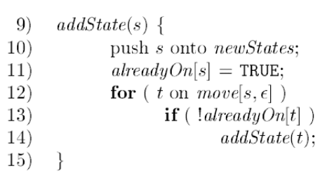
求状态转换 然后闭包 都仿佛new中
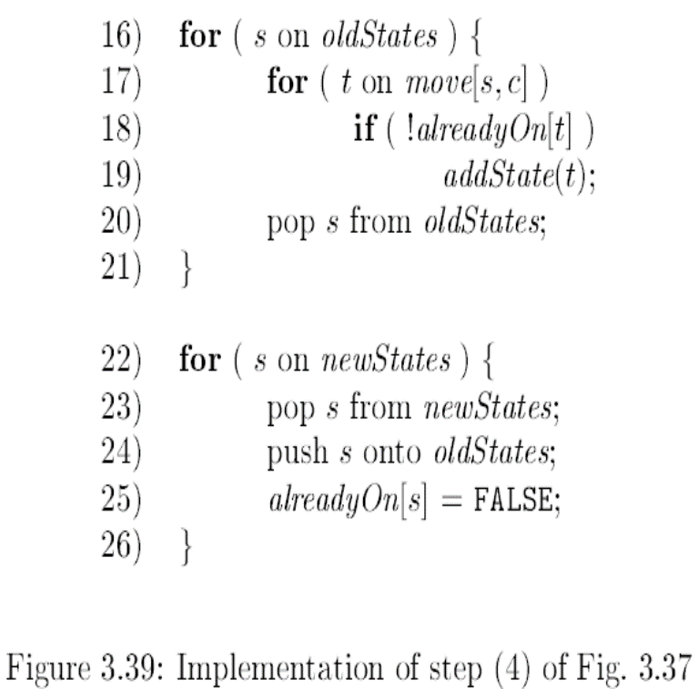
- 假设NFA有n个状态，m个转换，输入长度为k
复杂度为O(k(n+m))
##### 字符串处理算法效率
DFA的模拟更快，但其转换图可能更大（可能呈指数增长（子集构造法的最坏情况）

