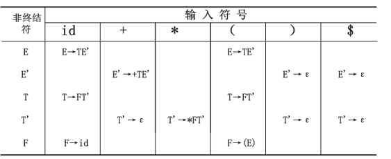
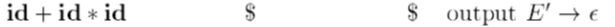
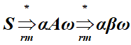

[toc]
## 分析器作用
##### 去除二义性：优先级
1. 先写终结符和最高优先级  自己-》自己op更高优先级
#### 错误处理
不同层次：词法 语法（阔话）
##### 恐慌模式和短语层次
- 每次抛弃一个输入符号，直至输入符号属于某个指定的同步记号集合为止
-对剩余输入进行局部纠正，用可以使分析器继续分析的输入串代替剩余输入的前缀 死循环 

## 上下文无关文法的分析
### CFG推导
构造出语法分析书 自顶向下
- 最左推导：选择最左的非终结符
- 最右推导：规范推导
### 分析数和推导
- 内部节点：非终结符
- 叶子：都可以
- 分析数不能表示推导过程
- 每个分析树对应的最右推导和最左推导都唯一
#### 归纳法
考虑A=α1 ⇒ α2… ⇒ αn
对每个句型αi，可以构造一个与之对应的分析树
1. 基础：α1 =A的语法树就是标号为A的单个节点
2. 如果已经构造了`αi-1=X1X2…Xk`的语法分析树，每个Xi都是一个文法符号。假设αi是将αi-1中的某个非终结符Xj替换`β=Y1Y2…Ym`后而得到的句型`αi=X1X2… Xj-1βXj+1…Xk`
3. 第j个非ε结点（即结点Xj ），以之为新子树的根，增加m个子结点（依次为符号串Y1Y2…Ym ）
4. 若m=0（即β = ε ），则给第j个结点增加标记为ε的子结点

### 验证文法生成的语言
- 相互包含：生成的都是 是的都能生成
- 括号配对程序
### 上下文无关文法和正则表达式
2型文法（上下文无关文法）描述能力强于3型文法（正则表达式与3型文法等价）
任何一个3型文法都是2型文法，反之不然，如语言L={anbn|n≥1}可用2型文法描述，但不能用3型文法或FA表达（证明参见课本）
#### 根据NFA构造正则文法
1. 将文法的非终结符Ai与NFA的状态i对应
2. 如果有NFA的状态i到状态j间有标记为a的转换边，则有文法产生式Ai →aAj，若a是ε，则有Ai →Aj
如果i是一个接受状态，则加入产生式Ai →ε
如果i是自动机的开始状态，则令Ai是所得文法的开始符号

### 设计
#### 不同文法表示语法和词法分析
- 正则——词法：词法规则简单
- 上下文无关——语法。复杂结构 ppt 22
##### 文法分解
- 将源语言的文法G分解为若干个子文法：G0,G1,…,Gn
1. 词法：文法G1,…,Gn分别描述语言的标识符、常数、运算符、界符等基本符号（单词符号）
2. 语法：文法G0借助基本符号来描述语言结构的文法
3. 词法的符号作为终结符出现在文法G0中

#### 消除二义性
- 悬空else
```
stmt→ if expr then stmt
         | if expr then stmt else stmt
         | other
```
解决：
```
stmt→ matched_stmt | open_stmt
matched_stmt→ if expr then matched_stmt else matched_stmt
             | other
open_stmt→ if expr then stmt
             | if expr then matched_stmt else open_stm
```
- 无关紧要：由于结核性 都无所谓的
#### 左递归消除
- 自顶向下无法处理
`A→Aα|β` -> `A→Aα|β` 直接左递归这么改就行
`A→Aα1|Aα2|…|Aαm|β1|β1|…|βn`
改为`A→β1A’|β2A’|…| βnA’
       A’→α1A’|α2A’|…|αmA’|ε`
- 一般左递归：算法在ppt34
#### 提取左公因子
- 推迟决定
- 悬空esle问题 例4.33解决

## 自顶而下的分析
- 定义：先根次序(自上而下、从左到右地)为输入串建立分析树，即为输入串寻找**最左推导**
- 分析关键：对于最左边的非终结符，选择他的哪个产生式 根据例子可看出是**根据向前看符号**
### 递归下降的语法分析（可能回溯）
- 带回溯很不好 耗时耗力
三种文法分类
1. 产生式右部终结符开始， 不重复
2. 右边右非终结符，但仍然唯一确认
   
#### frist集
1. 终结符：本身
2. 非终结符：
3. 产生空，加入空.不要忘了空！！
#### follow集
1. $放到开始符号的follow中
2. A->aBb first（b）中除了空
3. 若b=空，或**first（b）可以为空**，则follow（B）包含follow（A）和$
#### LL（1）文法
- 最左推导 从左向右扫描
- 性质：不是二义的 不含左递归 **不回溯**
- **证明**：1. A->a|b 而a和b的first交空，2. 对于first包含空的非终结符，查他在右边的时候，左边非终结符的follow和
  
### 预测分析器（递归下降的特例 不回溯）
#### 转换图（对于LL(1)）
##### 步骤
1. 首先消除左递归、提取左公因子
2. 每个非终结符一个转换图，每个产生式一条路
创建一个初始状态和一个结束（返回）状态
对于每个产生式A→X1X2…Xn ，创建一个从初始状态到结束状态的路径，路径中各条边的标号依次为X1、X2 、…、Xn ；
3. 特别是，如果A→ε，则路径上只有一条标号为ε的边
##### 预测分析和词法分析器不同
1. 预测分析器的转换图对每个非终结符都有一个图
2. 预测的图中边的标号可以是词法单元，也可以是非终结符号
   1. 如果是词法单元，意味着该词法单元是下一个输入符号时，分析器要执行这个转换
   2. 如果是标号为非终结符号A的转换，则对A的过程执行一次调用（编号为A的边可以替换为A的转换图）
** 简化转换图的例子**
消除尾递归 ppt52

#### 预测分析表（作业）
选择思路：右边不是空，按照first选，
右边是空，按照follow选，都选不了报错
- 表格式： ppt56
对文法G的每个产生式A→α，进行如下处理：
1. 对FIRST(α)的每个终结符a，把A→α加入到M[A，a]中
2. 如果ε在FIRST(α)中，对FOLLOW(A)的每个终结符b(含$),把A→α加入到M[A，b]中
3. 在完成上述操作后，如果M[A，a]中没有产生式，则将其error（意为语法错误，通常用空条目表示）
- 性质：本算法适用于任何文法G，只不过LL（1）条目唯一
### 非递归语法分析
- 显示维护栈
- 模拟最左推导
- 栈中存的是右边尚未被推导的部分
- 包括：输入缓冲区 栈（开始符号和$）分析表
#### 表驱动的预测分析（作业）
栈顶当前的符号X和输入符号a决定分析器的动作：输出一个最左推导
1. X=a=$，分析器宣告分析完全成功而停机
2. X=a≠$，分析器弹出栈顶符号X，推进输入指针，指向下一个符号
3， 如果X是终结符但不是a，则报告出错，调用错误恢复例程
4， 如果X是非终结符，程序访问分析表M，若M[X，a]是X的产生式，则将X弹出栈，将对应的产生式的右部依倒序压入栈，同时做相应的动作，如作为输出，打印所用的产生式，或执行其它代码等；
如果M[A，a]指示出错，分析器调用错误恢复例程




匹配单写一项
##### 错误恢复
当栈顶的终结符和下一个输入符号不匹配，或者栈顶是非终结符A，输入符号是a，而M[A，a]是空白时，预测分析器即发现一个错误
- 依然分为恐慌和短语层次

### 回溯的递归下降

- 

## 自底向上的分析
### 句柄
在这个位置可找到串β，用A代替β得到最右推导的前一个右句型。

- 文法无二义时，句柄是唯一的；否则，句柄不一定唯一
- 句柄的最右边的位置与栈的顶部对应
- 句柄的右边符号串只含有终结符号

### 移入规约分析技术
- 显示栈
- 分析器四动作：
栈 输入 
%  输入 句柄 动作（移入规约）
#### 概念
对输入符号自左向右
分析成功：栈中只剩开始符号
- 最右推导的逆过程：
   - 无二义性时 ，推导和规约都唯一
#### 冲突
两种冲突
给出简单的解决方案：1.优先一斤 2，改进词法分析器（细化词法单元）
### LR分析
- 定义：L指从左到右扫描输入，R指构造最右推导的逆
- 性质：1. 只要能够表示成上下文无关文法，就能够构造识别该结构的LR分析器
       2. LR方法能分析的文法类是预测分析法能分析的文法类的真超集

#### LR语法分析算法
- 性质：驱动程序对所有的LR分析器是一样的，只是分析表不同
- 栈顶是状态，概括栈中下面信息
- 格局：二元组（栈内容，尚未处理输出）是个最右句型
- 算法ppt108
##### actionhe goto
1. 栈顶当前状态i和当前输入符号a访问ACTION[i , a]，取值包括：
移进j，其中j是一个状态，表示将a移入栈，但是用状态j代替a
按文法产生式A→β归约
接受
报错
2. 定义在项目集上的GOTO函数扩展到定义在状态集上的GOTO函数
如果定义在项目集上的GOTO（Ii，A）= Ij ，则定义在状态上的GOTO（ i，A）= j

##### LR(0)分析表构造 由action 和 goto 构成
用到goto一定是发生了归约：
向前看符号失效！
- 分析过程表：分为步骤 状态栈 符号栈 输入串 action goto
- 步骤
  1. 第一行 步骤1 状态站0 符号栈$ 输入串完成 action(查表0行面对第一个字符的动作) goto
  2. 如果上一行是S动作：
     1. 符号栈加一，输入串减一
     2. s的角标入状态站顶，
     3. 根据当前栈顶查表，填action
  3. 如果上一行是r动作：
     1. 符号栈出产生式右边，左边产生式入栈
     2. 输入串不变
     3. 状态栈出右边的字符数个数字
     4. 根据目前栈顶状态和栈顶字母，查表goto，填上一行goto和这行栈顶
     5. 状态栈顶和下一个输入字符查表，填action
   
  
#### 项目：
- 分类
1. 内核项：包括初始项目S’→.S和所有点不在左端的项目
2. 非内核项：除了S’→.S之外的点在左端的项
##### 构造LR（0）项目表
1. 先增广
##### 项目构造NFA
先写出LR（0）项目
对于 标记为X的由状态A→α.Xη到状态A→αX.η的转换
1. X是终结符，表示**X入栈** （在分析中被从输入移进到栈的顶部）
2. 非终结符，**X→β归约**时发生，注意``这个归约前面必须有一个β的识别``，而由初始项目X→.β给出的状态表明这个识别的开始
3. 加入空转换，对每个项目A→α.Xη，添加一个到项目X→.β的ε转换
###### 识别可行前缀的NFA： 
- 每个项目作为一个NFA状态，
- 两种线：1项目i到项目j的连线：标记为Xi 2.e转换
- 项目分类：根据圆点位置和原点后是否终结符分类：
##### 项目集族构造DFA
通过上一级NFA可以改造成DFA，其中项目合并，状态减少
- closure求一个DFA一个状态的项目集
1. 先构造初态项目集，然后圆点向右移动一格，对圆点后为非终结符的产生式求closure，构成新状态的项目集
- 同理，项目规范集族也可以分为4种：注意 一个项目集种不能同时移进规约(LR（0）不论向前看符号 )也不能归约归约冲突，这是必要条件！
##### GOTO转换函数
对应于DFA 先转换 再求闭包

#### LR文法
- 条目唯一分析表
- 性质：
1. 只要保证当句柄出现在栈顶时，自左向右扫描的移进-归约分析器能够及时识别它便足够了
2. 如果句柄出现在栈顶时，LR分析器不需要扫描整个栈，栈顶的状态符号包含了所需要的一切信息
3. 与LL文法的区别：
LR(k)文法：在看见了产生式右部推导出的所有东西和k个向前看的符号后，能识别产生式右部的出现
LL(k)文法：在看见了右部推出的前k个符号就能识别所使用的产生式
##### LR(0)
- 定义：项目集族不存在两种冲突


### SLR表分析
- 用follow集进一步解决冲突比如`I = { X→α.bβ,
       A→α. ,
       B→α. }`
(1)构造C={I0 , I1 , … , In }，即G’的LR(0)项目集规范族
          (2)状态i从Ii构造，它的动作如下确定：
       (a) 如果[A→α.aβ]在Ii中，并且δ( Ii , a) = Ij，则置
           ACTION(i , a)为sj,含义是把a和状态j移进栈, a必须为终结符
       (b) 如果[A→α.]在Ii中，则**对FOLLOW(A)中的所有a**，置
           ACTION(i , a)为rj, j是产生式A→α的编号。含义是按产生	    式A→α归约，这里A不是S’
       (c) 如果[S’→S.]在Ii中，则置ACTION(i , $)=acc，表示接受
          (3)对所有的非终结符A，使用下面的规则构造状态i的转移：
         如果δ( Ii , A) = Ij，则GOTO[i , A]=j
          (4)不能由规则(2)和(3)定义的条目置为出错
          (5)分析器的初始状态是包含[S’→.S]的项目集对应的状态

#### SLR（1）
- 一定没有二义
- 具有冲突的两种情况：
1. 对于在栈顶状态s中的任何项目A→α.Xβ，当X是一个终结符，且X在FOLLOW (B)中时，s中没有完整的项目B→γ.。（若不满足，则存在移进-归约冲突）
2. 对于在s中的任何两个完整项目A→α.和B→γ.，FOLLOW(A)与FOLLOW(B)的交集为空集。（若不满足，则存在归约-归约冲突）

### LR(1)规范分析
#### LR（1）项目
LR(1)项目：[A→α.β，a]，其中A→αβ是产生式，a是终结符号或$。
只有b为空，搜索符才有意义
只需要修改closure和goto
1. closure 

#### 可行前缀
- 项目和活前缀的关系：
   **有效**：
1. A→β1.β2对活前缀αβ1有效表明当αβ1在分析栈顶时
   如果β2是ε，则A→β1是句柄，应该用这个产生式归约
   如果β2不是ε，则表示句柄还没有完全进栈，要继续移进
   同一个活前缀的两个有效项目可能对应了不同动作，引起了冲突
   这种冲突可以通过向前看几个符号解决，也可以通过其它方式解决
   
- 清华书总结了3中识别可行前缀的DFA方法
- 当前状态时或前缀的识别态，说明已分析过的时该文法的某规范巨型的一部分，说明分析过的是正确的，
- 性质：
1. 栈中内容代某个最右句型的前缀，如果剩余的输入是x，则αx就是一个右句型，可以归约到文法的开始符号
2. 不是所有的最右句型的前缀都可以出现在栈里的，栈里的内容不能越过句柄
- SLR(1)和LR(1)对向前看符号的使用的不同：
SLR(1)是在LR(0)项目的DFA构造完成后才考虑提供向前看的符号，DFA的构造中不考虑向前看的符号
LR(1)是在一开始就考虑向前看符号，DFA的构造是在考虑向前看符号的基础上进行的

#### LR（1）表构造
项目族构建写出goto【I0,s】这样的
- 包含直接转换和闭包
G’的LR(1)分析表函数ACTION和GOTO
方法：(1)构造C={I0 , I1 , … , In }，即G’的LR(1)项目集规范族
        (2)状态i从Ii构造，它的动作如下确定：
       (a) 如果[A→α.aβ, b]在Ii中，并且GOTO( Ii , a) = Ij，则置
           ACTION(i , a)为“移进j”，a必须为终结符
       (b) 如果[A→α. , a]在Ii中且A不是S’，则置ACTION(i , a)
         为“归约A→α”
       (c) 如果[S’→S. , $]在Ii中，则置ACTION(i , $)=acc，表示接受
        (3)对所有的非终结符A，使用下面的规则构造状态i的转移：
         如果DFA的转换函数GOTO( Ii , A) = Ij，则GOTO[i , A]=j
        (4)不能由规则(2)和(3)定义的条目置为出错
        (5)分析器的初始状态是包含[S’→.S , $]的项目集对应的状态


#### LALR
将具有相同核心的LR(1)项目合并，动作和转移函数也做相应的合并
LALR分析表
- LALR(1)分析表是在LR(1)分析表的基础上构造的，但可能引入LR(1)分析中不存在的冲突
- LR(1)能发现的错误，LALR(1)也能发现，只是在报错前可能要多作一些虚假的归约

两种构造方法
1. 按照LR（1）
2. LR（0）项目的内核生成LALR（1）项目的内核


#### LR二义性应用
消除二义性：
1. 用优先级和结合规则：在表达式文法中，可以在分析器中明确规定*优先于+，左结合等约定，从而消除二义性
2. 移进优先于归约（解决悬空else）
3. 特殊情况产生式引起的二义性，可能导致归约-归约冲突，可以规定此时按特殊情况产生式归约

#### 错误纠正
- 分析表中的空白
1. 紧急方式：栈顶开始退栈，直至出现状态s为止，它有选定的非终结符A的转移（自己设定删除到哪）抛弃0个或多个输入符号，直至找到符号a为止，它能合法地跟随A
2. 短语级恢复：考察LR分析表的每个出错条目和根据语言的使用情况决定可能引起该条目的输入错误，然后为该条目编一个适当的错误恢复例程
