[TOC]
# 代码生成器
## 代码生成器输入
### 符号表
- 决定中间表示中名字所代表的数据对象的**运行时刻地址**
1. 偏移量
2. 作用域
- 可能在动态时刻作为调试信息存在

### 中间表示
## 目标程序
### 主要形式：
1. 绝对机器语言 
2. 可重定位的机器语言
3. 汇编语言
4. 字节码
## 指令选择

### 高低IR层次
### 目标指令体系
## 寄存器分配

# 目标语言
## 简单目标机模型
### 构成
具有加载和保存操作、计算操作、跳转操作和条件跳转
字节寻址
有n个通用寄存器R0 , R1 , … , Rn-1
有限的指令集，且假设所有运算分量都是整数
指令形式：大部分指令包括一个运算符、一个目标地址，最后是一个源运算分量列表，指令前可能有一个标号
label：op    dst ，src
加载运算：LD dst , addr
把位置addr上的值加载到位置dst
表示赋值 dst = addr
保存操作：ST x , r
把寄存器r的值保存到位置x，表示赋值x = r
### 寻址模式
3种

### 指令代价

# 目标代码
## 静态分配
## 栈分配
- 一个过程活动记录的位置只有在**运行时**才知道
- 如何访问：活动记录的存储单元采用**偏移量**访问
- 过程调用实现方法：寄存器SP：指向***栈顶活动记录开始**的指针
SP的增加或减少来表现过程调用的发生和返回
### 过程调用的处理
第一个过程的代码通过将SP置为存储器中栈区的开始位置来初始化栈：
        LD	SP , #stackstart	// 初始化栈
        code for the first procedure
        HALT			// 结束运行
- 保存返回地址：
其它的过程调用序列给SP一个增量，并存储返回地址及将控制转移到被调用过程
        ADD SP , SP , #caller.recordSize  // 增加SP
        ST     0(SP) , #here + 16	      // 保存返回地址
        BR    callee. codeArea	          // 转移到被调用过程
- 过程返回的处理
在被调用过程中
    BR   * 0 ( SP )		// 返回到调用过程
- 调用者恢复SP
    SUB  SP , SP ,  #caller. recordsize
将SP指针指向调用者活动记录的开始处
### 名字的运行时刻地址
1. 三地址代码中的名字：用一个指向该名字符号表条目的指针表示
2. 名字最终必须被替代为访问存储位置的代码
## 程序分析技术
优化：程序的等价变换
### 流分析
应用静态程序分析技术给出动态时刻程序中变量的使用情况

# 优化
## 基本块（图形式构造IR）
### 构造基本块方法
1. 把中间代码划分成基本块（basic block，BB），每个基本块满足如下条件：
控制流只能从基本块的第一个指令进入
除了基本块的最后一条指令，控制流在离开基本块前不会停机或者跳转
基本块形成了流图（flow graph）的结点，流图的边指明了哪些基本块可能紧随一个基本块之后执行

### 后续使用信息
- 算法8.7：对一个基本块中的每一个语句确定活跃性与后续使用信息
- 输入：一个三地址语句的基本块B，假设在基本块B开始时，所有的非临时变量都是活跃的
- 输出：对于每一个语句i：x  = y op z，将x、y及z的活跃性信息及后续使用信息关联到i
- 方法：从的最后一个语，反向扫描到开始处。
对每一个三地址语句 i：x  := y op z，依次执行下述步骤：
1. 把当前符号表中x、y和z的后续使用信息和活跃信息附加到语句i上；（若x不活跃，则这个语句可以删掉）
2. 在符号表中设置x为“无后续使用”和“不活跃”；
3. 把符号表中y和z的后续使用信息均置为i，活跃信息均置为“活跃”。 
**注意：上述次序不能颠倒，因为x可能是y或z**

### 基本快的优化
#### 基本块的DAG表示：
- 基本块中出现的每个变量有一个对应的DAG结点表示初始值
- 每个语句s都有一个相关的结点N，
1. 如果s的某个运算分量在基本块内定义值：N的子结点是基本块中的其他语句的对应结点，这些语句在s之前，且是最后一个对其定值的语句
2. 如果s的某个运算分量没有在基本块内定义值，则对应的子结点是表示其初始值的结点
3. 结点N的标号是s中的运算符，且有一组变量被关联到N，表示s是在此基本块内最后对这些变量进行定值的语句
- 输出节点：某些结点，这些结点的变量在基本块的出口处活跃
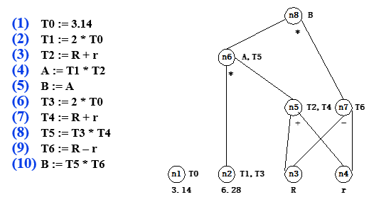

#### 优化方式
##### CSE消除局部公共子表达式
避免重复计算
- 检测公共子表达式的“值编码”方法
当一个新的结点M将被加入到DAG中时
检查是否存在一个结点N，它和M具有同样的运算符和子结点，且子结点顺序相同
若存在，则N计算的值和M计算的值是一样的，可以用N替换M
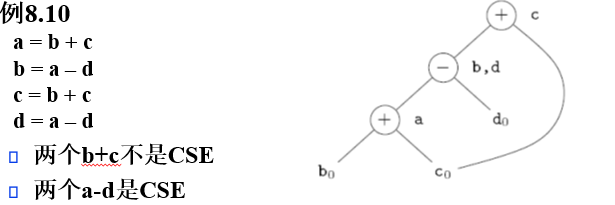
- 考虑：只有n个非叶子结点，是否只用n个三地址语句实现
- 如果变量x被定值两次，或者虽然只赋值一次，但初始值x0被使用过，则必须保证不会在原先存放x值的结点被全部使用之前改变x的值（保证正确的依赖关系）
- 现有方法无效的例子
1. 消除死代码（dead code）
计算得到的值不会被使用的指令
- 无父节点且不活跃
2. 进行语句重排
重排的语句间没有依赖关系
改善执行时间
缩短变量的活跃区间，减少某个量占用寄存器的时间
1. 利用代数规则，重新排列三地址语句中运算分量的顺序
- 一类重要的优化方法，一些恒等式如
x + 0 = 0 + x = x		x – 0 = x
x * 1 = 1 * x = x		x / 1 = x
- 局部强度削弱
将代价较高的运算替换等价的但代价较低的运算，如
    代价较高的		代价较低的
             x2		=	    x * x
           2 * x	=	    x + x
           x / 2		=	    x * 0.5

- 常量合并
  在编译时刻对常量表达式求值，并将常量表达式替换为求出的值
  编译时刻求值必须使用和运行时刻相同的求值方法
  可以对常量表达式进行编译，在目标机上执行，然后将表达式替换为执行结果
  例如：将2*3.14替换为6.28
  
#### 数组引用的表达
DAG中，表示数组访问的正确方法
1. 取数组元素的右值（如x = a[ i ]），用新创建的运算符为=[ ]的结点表示，其左右子结点分别代表数组初始值（本例中为a0）和下标i，变量x是该结点标号之一
2. 取数组元素的左值（如a[ j ] = y），用新创建的运算符为[ ]=的结点表示，这个结点的三个子结点分别表示a0 、j和y，没有变量用这个结点标号
3. 左值结点的创建杀死了所有当前已建立的，其值依赖于a0的结点
4. 被杀死的结点都不再有标号，且不能作为CSE
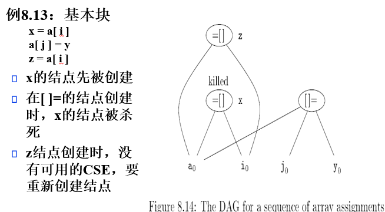

#### 指针赋值和过程调用
1. =*必须把当前所有带有附加标识符的结点当作其参数，会影响死代码消除
2. *=会把迄今为止构造出来的DAG中的其他结点全部杀死
- 可进行指针分析，将指向关系确定在一个较小集合中
例如：p = &x
*p = y进行指针分析后，可知*p的赋值只影响x，所以只需杀死以x为附加变量的结点

- 调用过程p类似，如果不分析，则认为p改变了它访问的所有变量，影响过大
可考虑过程间分析，缩小影响范围

### DAG到基本快的重组
- DAG优化的时机
在DAG生成的同时进行，或
在DAG构造完成后实施
- 重组
中对DAG中每个结点的处理方法
1. 对每个有一个或多个附加变量的结点，构造一个三地址语句计算其中某个变量的值（我的理解：每个非叶子节点对应一条三地址）
优先选择在基本块出口活跃的变量
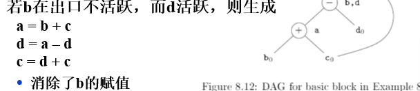
2. 如果没有全局活跃变量的信息，则假设所有变量在基本块出口都活跃
编译器为了处理表达式而生成的临时量不在此列
3. 如果一个结点有多个附加的活跃变量，则需要利用复制语句
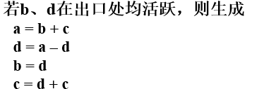

- 满足依赖关系
1. 父结点计算在子结点计算之后
2. 对数组的赋值必须跟在所有（按照原基本块中的指令顺序）在它之前的对同一数组的赋值或求值之后（求值可换序 赋值不可）
3. 变量的使用必须跟在所有（在原基本块中）在它之前的过程调用和指针间接赋值运算之后
4. 过程调用或者指针间接赋值都必须跟在所有（在原基本块中）在它之前的对任何变量的求值运算之后

## 控制流图六分析
### 流图
结点是基本块的有向图G = ( N, E, root)
- 定义
1. 每个结点表示一个基本块
2. 如果结点ni和nj间存在前驱和后继的关系，则在存在一条从ni到nj的有向边（此时意味着，在ni执行后，**可能**会执行nj）
i. ni的出口语句是goto(s)或if … goto(s)，且(s)是的nj入口语句
ii. nj在程序中的位置紧跟在ni后，且ni的出口语句不是无条件转移语句和停语句
5. root是流图的首结点（或称为根结点），是包含程序第一个语句的基本块
6. 每个流图都可以等价变换为单入口，且每个结点最多有两个后继的图

- 增加两个分别称为“入口”（entry）和“出口”（exit）的结点
- 数据结构： 指令链表更高效
  
#### 流图遍历
##### 深度优先排序
从入口开始，首先访问立入口最远的节点
- 与后序遍历顺序相反
##### 深度优先搜索树
前向边(forward edges)：深度优先搜索树上, 前驱指向后继的边
后退边(back edges)：深度优先搜索树上, 后继指向前驱的边 dfn【m】>=dfn[n] m->n
交叉边(cross edges)：不属于前两种的边
- 深度优先序不是唯一的，依赖于后继结点的选择次序
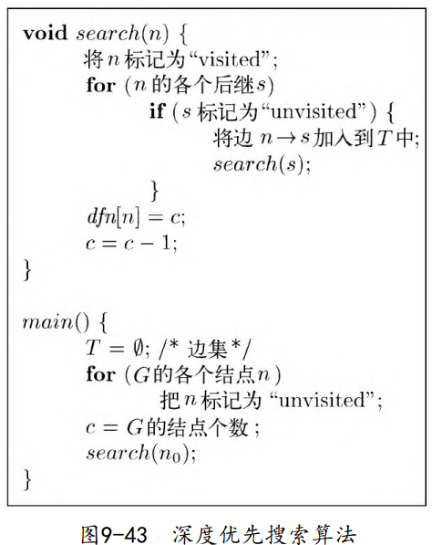
#### 控制节点
n dominates m (n dom m) <==> 从root到 m的所有路径都经过n
n 是 m 的dominator
- 真控制：如果n != m，则 n strictly dominate m
- 直接控制：如果不存在n’, 使n dom n’, n’ dom m, 则n immediate dominate m
- 控制关系构成偏序关系
自反：每个结点dominate 自己
传递：a dom b, b dom c ==> a dom c
反对称：a dom b and b dom a ==> b = a
- **求节点**
D（n）= {n} 并 （所有前驱的D）初始化是节点全集

#### 循环

#### 归约
##### 回边与后退边
任何流图，灰边都是后退边，但后退边不是回边

结构化程序的流图是可归约的，如do, while, repeat, if ,break, continue等。
数据流分析的许多方法只适用于可归约流图
流图G是可归约的<==>它的边集 E可以被分割成两个集合E1,E2, 使得	
D = ( N, E1, s )是一个G的最大无环子图
E2中的每条边都是回边
不可归约流图的例子
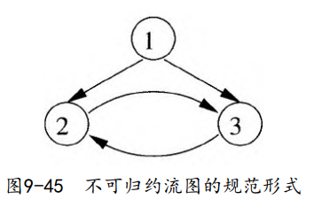
- 性质
可归约流图中任何直观意义下的环路，都属于前面定义的循环
只要找出图中所有回边，对回边应用前述算法，就可得到流图中所有的循环
判断一个流图是否是可归约的，只需检查所有前向边是否构成无环有向图即可

### 数据流分析
- 到达定值问题：分析程序中到达某点的定值
定值：给一个变量赋值
某定值到达程序中某点：执行时，存在一条从该定值到该点的路径，在这条路径上，被定值的变量的值保持为该定值所赋的值。
- 活跃变量问题：分析在程序的某点有哪些变量活跃
变量在某点活跃：在此点开始的路径上有对该变量的引用，否则，称为该变量在该点死亡
- 可用表达式问题：分析在程序的某点有哪些表达式可用
表达式在某点可用：从程序的初始点到该点的每条路径上都有对该表达式的计算，且在最后一个这样的计算和该点之间没有对此表达式中所用到的变量的赋值

#### 过程内流分析
解决全局数据流问题时，基本块内的分析在局部数据流分析时完成
在全局数据流分析时，关心基本块的副作用。
- 流值：程序中的变量、表达式或其它程序结构的语法抽象性质

##### 数据流分析模式
- 传递函数
- 两个约束

##### 数据流模式

#### 到达定值
- 变量x的定值：是一个语句，它（可能）赋值给x
1. 无二义的定值：语句真正对x定一个值
2. 二义的定值：
x作为形式参数，或由于别名的关系
通过引用x的指针对x赋值
- 到达：对于变量而言，变量的定值从某条路径传递，到达某个节点时依然有效
- 注销：这条路径上有对变量a的其它定值，则称前面的定值被注销

##### 达到定值的数据流方程
gen[B]：基本块B中的定值d到达B的结束点，则d∈gen[B]
kill[B]：程序中不能到达B的结束点的定值d，则d∈kill[B]
in[B]：到达B的开始点的定值集合
out[B]：到达B的结束点的定值集合
- 流方程
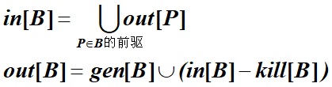

#### 可用表达式
- 表达式x+y在点p可用：如果从初始结点到p的每条路径上（不必是无环）都计算x+y，并且在最后一个这样的计算和p之间没有对x或y的赋值
- 注销表达式x+y：如果它对x或y赋值（或可能赋值），并且随后没有重新计算x+y
- 产生表达式x+y：如果它计算x+y，并且随后没有重新对x或y定义
- 基本应用是寻找公共子表达式

- 数据流方程
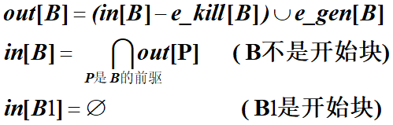
##### 某点可用表达式集合求法
把表达式y+z加入A中
删掉A中任何含x的表达式
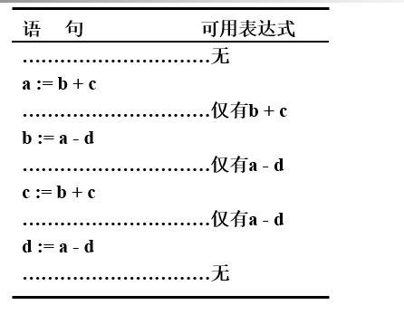

#### 到达定制和可用表达的关系
1. 初值设置不一样
到达—定值in[B1]的初值未特殊定义
可用表达式的in[B1]的初值定义:开始块必须定义为空集
2. 合流算符不一样
到达—定值的算符为集合并，因为是求May
计算从小集合开始，迭代得到最终的解，集合是扩大的
可用表达式的算符为集合交，因为是求Must
计算从大集合开始，逐步削减集合中的元素，最终得到解

#### 活跃变量
如果对于变量x和点p，x的值在由p点开始的路径上是否引用，如果引用，则称x在p点活跃
否则称x在p点死亡
- 与寄存器有关系：寄存器中的值在基本块结束死亡，则不用写回内存，这个寄存器也可以优先被分配它用

- in[B]：块B开始点的活跃变量集合
out[B]：块B结束点的活跃变量集合
def[B]：块B中无二义定值且在该定值前没有引用的变量集
use[B]：块B中可能引用且在该引用前没有定值的变量集
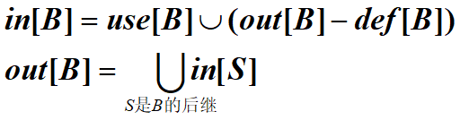
_意思是：进入B时已被赋值的活跃变量是B中在定义前引用的和B之后需要但没有在B中定义的_
对每一个块做好这个
#### 处理更复杂的数据类型

## 跨域基本快的优化

### 全局公共子表达式删除
- 借助于可用表达式实现公共子表达式的删除
- 删除算法
- 对每个形如x := y + z（+表示一般的算符）的语句s，如果   y + z在s所在块的开始点可用，且在该块中s前没有y和z的定值，则执行下面的步骤：
  (1)	为了寻找到达s所在块的y + z的计算，顺着流图的边，从该块开始反向搜索，但不穿过任何计算y + z的块。在遇到的每个块中，y + z的最后一个计算是到达s的y + z的计算
  (2)	建立新变量u
  (3)	把(1)中找到的每个语句w := y + z用下面的两个语句代替
      u := y + z
      w := u
  (4)	用x := u代替语句s

#### 复写传播
形如x := y的复写语句
想做的优化：安全删除x=y并将x替换为y 
需要满足的条件：
1. 要删除语句 x := y，必须确保在引用 x 的所有地方，x 都只被赋值一次，即语句 x := y 是到达引用点的唯一赋值语句。
2. 数据流：从赋值语句 x := y 到 x 的每个引用点 u 的路径上，不能有对 y 的再次赋值。这意味着在 x 被赋值和使用的过程中，y 的值不能被改变，否则替换 x 为 y 可能会导致错误的结果。
  
- 数据流方程
采用并集

### 循环不变量的计算 和两个循环优化
只要控制不离开循环，它的值就不改变
可以用ud链寻找循环不变计算

- 算法理解：
1. 标记常数和外部定值：
<small>_首先，识别出所有运算对象是常数的语句，将它们标记为“不变”。常数的值自然是不变的。
然后，识别出所有到达定值（即UD链中的Def点）在循环 L 外部的语句，也标记为“不变”。如果一个变量在循环外部被赋值，并且在循环内部没有再次被赋值，那么它的值在循环中是不变的。_
2.  <big> 标记单定值且为“不变”的语句：
<small>_这些语句的所有运算对象都是常数，或者它们的到达定值都在循环 L 外部，或者它们只有一个到达定值，并且这个定值是循环 L 中已经被标记为“不变”的语句_

#### 代码外提
外提语句s: x := y + z的条件（这3个条件都不是必要的）
1. 含s的块是循环中所有出口结点的必经结点
出口结点是有后继不在循环中的结点
只要循环不是无限循环，则所有出口的必经结点一定会执行（_只要出循环，一定经过s_）
2. 循环中没有其它语句对x定值
如果x是只赋值一次的临时变量，这个条件肯定满足
3. 循环中x的引用仅由s到达
如果x是临时变量，这个条件一般也满足

- ppt上三个例子
##### 代码外提算法
1. 寻找循环不变计算
2. 检查外提条件
  _(a) s 所在的块是循环 L 所有出口的必经块。这意味着无论循环如何退出，s 都会执行。 
  _(b) 在循环 L 的其它地方，变量 x 没有被重新赋值._
  _(c) 循环 L 中所有对 x 的引用都是通过语句 s 来赋值的，即 s 是 x 在循环中的唯一定义点。_
3. 根据循环不变计算的算法找出的次序，选择满足条件 (2) 的语句进行外提。
4. 移动语句到前置块：将满足条件的语句移动到新的前置块中。前置块是在循环开始之前执行的代码块。
如果语句 s 的运算对象（如 y 和 z 在 x := y + z 中）在循环 L 中定义，并且这些对象的定值语句也被识别为循环不变计算，那么只有当这些运算对象的定值语句先被外提到前置块之后，s 才能被外提。

##### 理解算法的关键点
理解算法的关键点
循环不变性：识别出在循环中每次迭代都产生相同结果的计算。
必经块：确保外提的计算在退出循环前一定会执行。
单次赋值：确保变量在循环中只被赋值一次，这样外提后才能保证其值的正确性。
引用追踪：确保变量的引用只能通过特定的定值语句到达，这样外提后不会影响到程序的逻辑。
依赖性：如果一个计算依赖于另一个循环不变计算的结果，需要先外提依赖的计算。

##### 外提后数据流信息维护

#### 归纳变量
- 每次都是增加或减少固定常数，常见于数组的下标
_j 相关的三元组 (i, c, d)：其中 i 是基本归纳变量，c 和 d 是常量。在 j 的定值点，j 的值可以表示为 c * i + d 的形式。如果 j 属于 i 族，即它的值与 i 的值有线性关系。_
- 基本归纳变量：变量i只有唯一形如i := i ± c的赋值
  

-识别算法：
1. 找出所有基本归纳变量（使用循环不变计算的信息）。对应于基本归纳变量i的是三元组（i, 1, 0）
(2)	寻找L中只有一个赋值的变量k，它具有下面的形式之一：
    k := j * b,  k := b * j,  k := j / b,   k := j ± b,  k := b ± j
    其中，b是常数，j是基本的和非基本的归纳变量，如果j是	基本的，对应的三元组定义简单；
    如果j是非基本的，它属于i族，则附加如下要求：
    (a) 在循环L中对j唯一赋值和对k的赋值之间没有对i的赋值
    (b) 循环L外没有j的定值可到达k的这个定值点
    如果j的三元组( i, c, d)，k := b * j，则k的三元组( i, b*c, b*d)
基本归纳变量：循环中每次迭代都按固定模式变化的变量。
变化模式：通过三元组 (i, c, d) 表示变量的变化模式，其中 i 是基本归纳变量，c 是步长，d 是初始值。
非基本归纳变量：可能与基本归纳变量有线性关系的变量，其变化模式可能依赖于基本归纳变量。
赋值条件：确保在识别归纳变量时，变量的赋值不受循环外部的影响，且在赋值过程中基本归纳变量的值保持不变。

##### 强度削弱
- 用执行较快的指令代替执行较慢的指令
  归纳变量后，加减法代替乘除法
- 删除某归纳变量：如t = 4 * i ），因此可以用某个归纳变量的测试（如t）代替这个归纳变量的测试（如i）

## 窥孔优化

## 寄存器分配和指派
### 全局寄存器分配

### 保存寄存器的收益计算方法（使用计数）
- 基本块：
1. 每次引用节省一个单位的用于加载的开销
只有当x在循环L的某个基本块内被使用，且在同一基本块中x没有被先行赋值（使用前没有更新新值）
2. 
如果x在基本块中定值且在出口活跃，则x分配在寄存器中可以节省两个单位的开销
- 循环：
1. 循环头部的入口活跃，进入循环前把x加载寄存器，需要两个单位的开销
2. 循环出口活跃，两个单位的开销将x保存起来
但考虑到循环可能被迭代执行多次，而循环入口/出口基本块的特殊处理指令只执行一次，所以可以考虑忽略这些开销

- 收益估算公式：
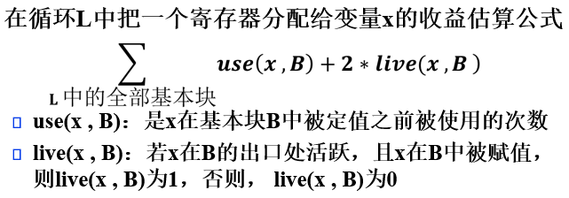

### 图着色问题的寄存器分配
第一遍，扫描代码，将三地址代码中的变量名转换为符号化寄存器的名字（假定有无穷多的符号化寄存器）
第二遍，构造变量使用的干涉图，利用图的k-着色方法（可以把k看成是寄存器的个数）
尽可能减少访存的次数

- 变量的活跃区间：
一个变量的（极小化）活跃区间是变量的定值与引用的一个子集，对于此集合中的任意定值dm和引用un，或者un在dm的du链上，或者存在一个由此集合中的定值与引用组成的交错序列dm=d0、u0、d1、u1、、、dk、uk= un，其中的任何一个ui、同时在di和di+1的du链上。
直观上，变量的活跃区间对应于流图上联结变量的定值点和引用点的一个连通区域。
- 干涉：
两个变量的活跃区间干涉（简称两个变量干涉），若在其中某个变量的定值处，另一个变量是定值到达和活跃的。
